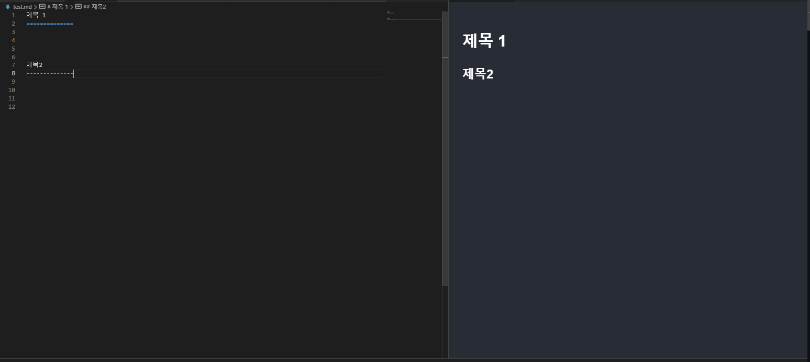
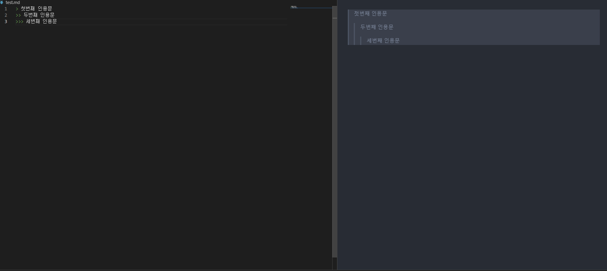
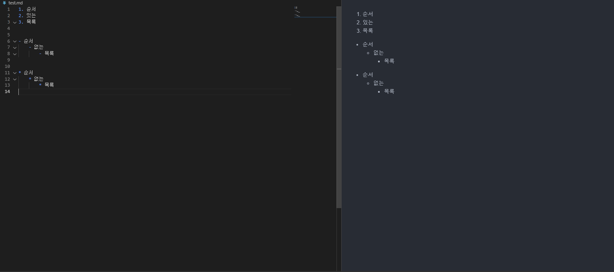
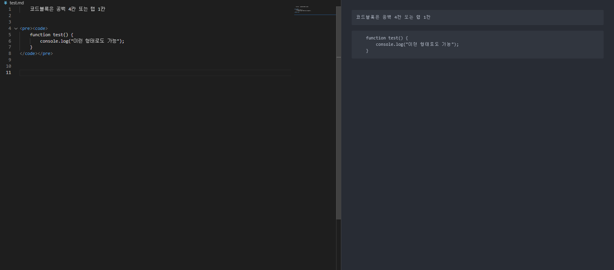
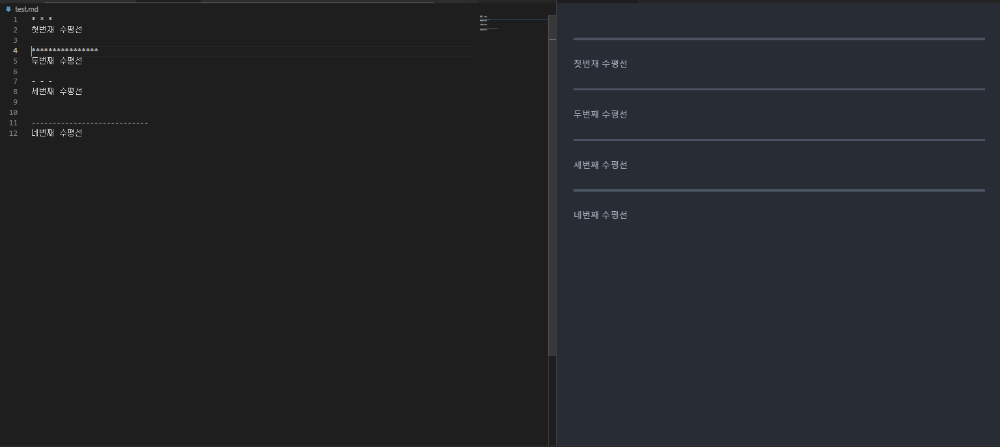
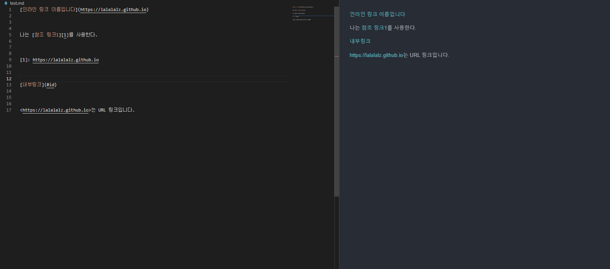
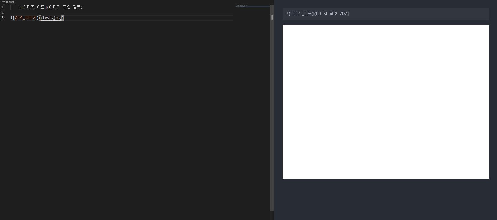
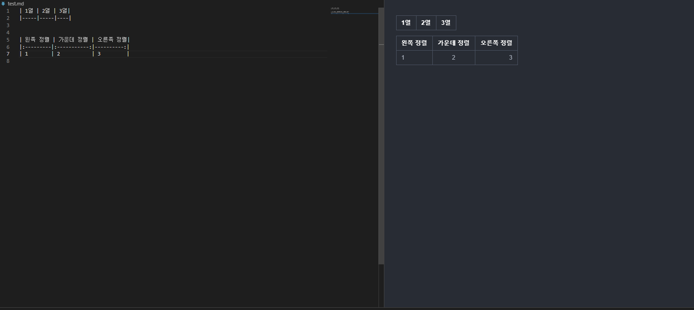
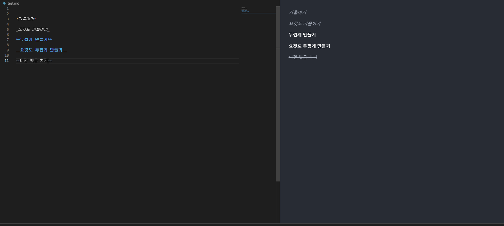
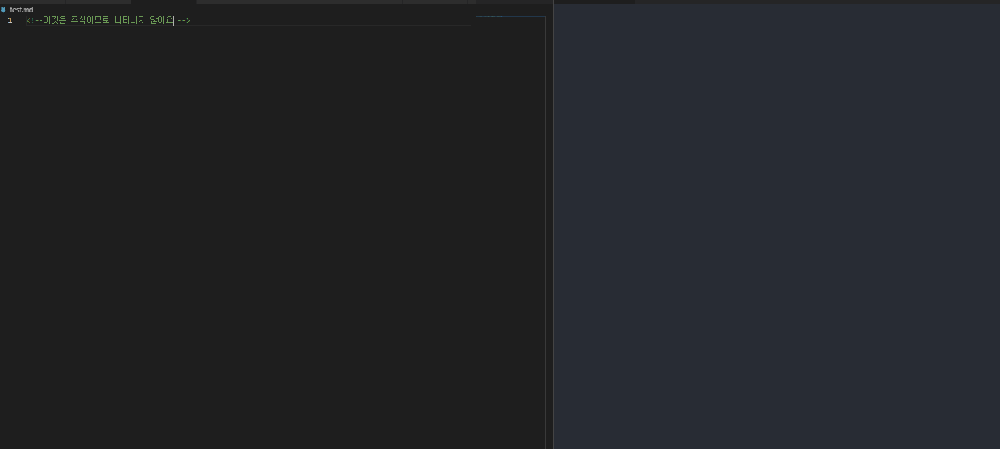

# 마크다운이란?

마크다운은 존 그루버와 아론 스워츠가 이메일 글쓰기 형식에 영감을 받아 Python을 이용한 html
변환기를 만들면서 시작되었다.

즉, 마크다운은 *텍스트를 HTML로 변환*하는 언어이자 도구이다. 

# 마크다운 주요 문법

## 1. 헤더

    #      -> <h1> (밑줄 포함)
    ##     -> <h2> (밑줄 포함)
    ###    -> <h3>
    ####   -> <h4>
    #####  -> <h5>
    ###### -> <h6>

    
## 2. 제목

    제목은 대제목과 소제목으로 나눌 수 있는데 이때 각각은 #, ##과 같다. 이때 '=' '-' 의 갯수는 최소 3개 이상이면 된다.
    

## 3. 인용

    인용문 안에 다른 마크업 요소를 추가할 수 있다.

## 4. 목록

    목록은 순서가 있는 것과 없는 것으로 나눌 수 있으며 순서가 있는 목록의 경우는 자동으로 내림차순 정렬이 된다. 
    

## 5. 코드

    코드블록을 만드는 방법은 크게 두가지가 있다. 기본적으로 공백 4칸 또는 탭 1칸을 이용하여 만들 수 있다.

## 6. 수평선

## 7. 링크

## 8. 이미지

## 9. 테이블

    테이블은 왼쪽 정렬 가운데 정렬 오른쪽 정렬을 설정할 수 있다.

## 10. 강조

## 11. 주석

